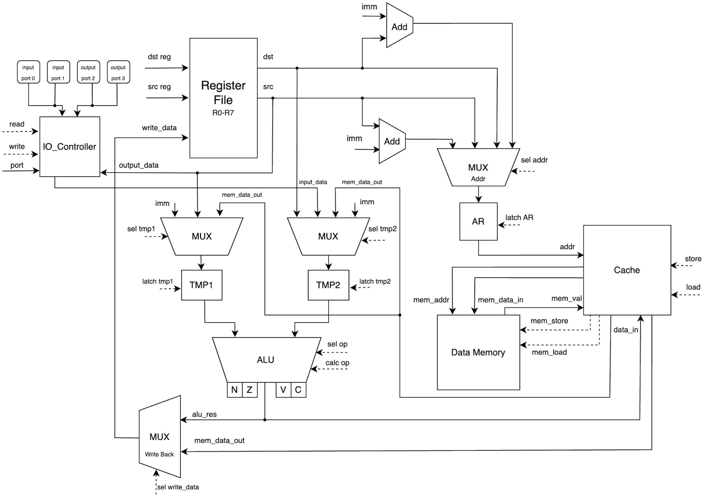
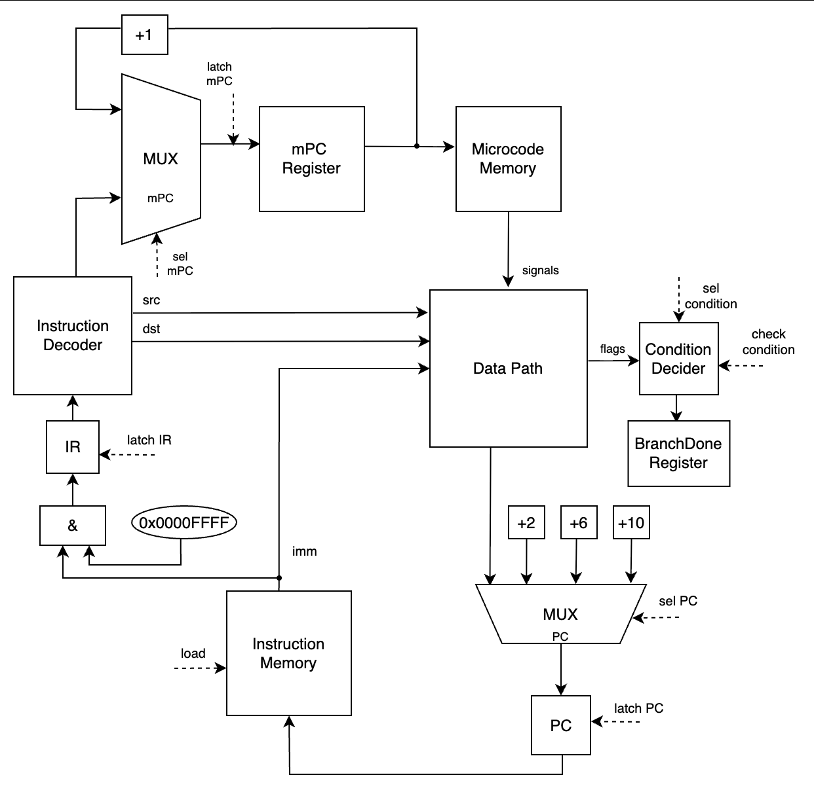
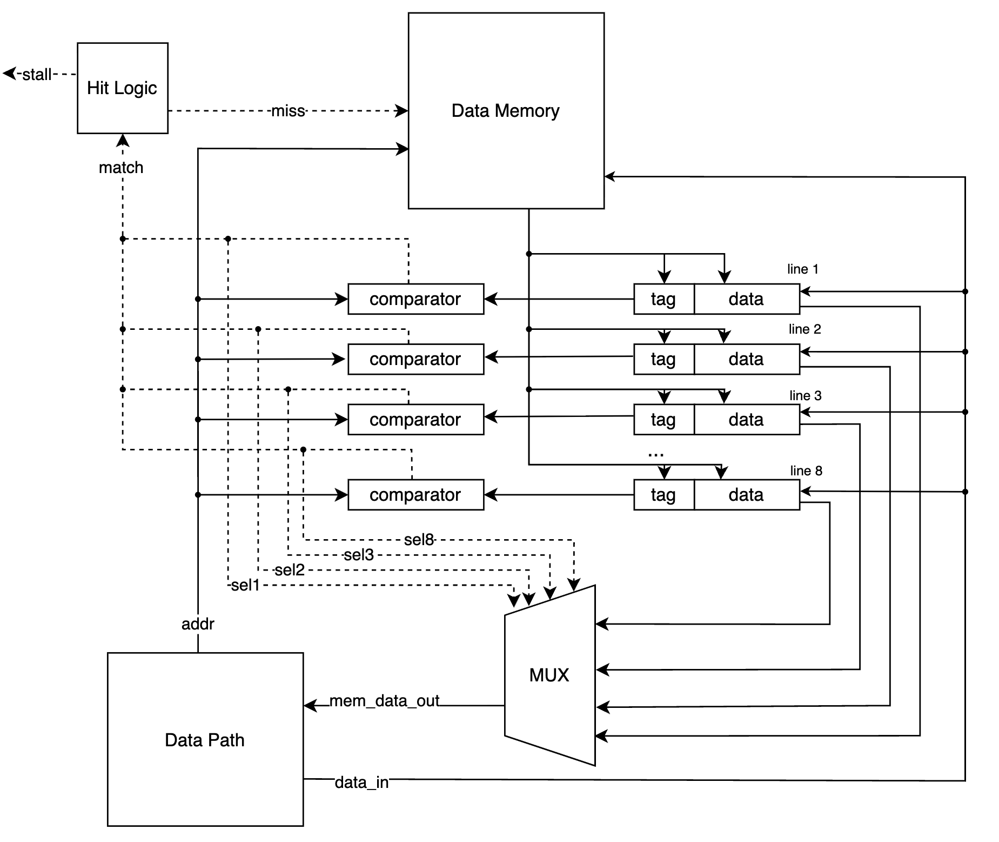

# Лабораторная работа №4
**Выполнила:** Абдуллаева София Улугбековна, P3208\
**Вариант:** `alg | cisc | harv | mc | tick | binary | stream | port | cstr | prob2 | cache`

---
## Содержание
- [Язык программирования](#язык-программирования)
    - [Синтаксис](#синтаксис)
    - [Семантика](#семантика)
- [Организация памяти](#организация-памяти)
    - [Адресация](#адресация-памяти)
    - [Регистры](#регистры)
- [Система команд](#система-команд)
    - [Флаги процессора](#флаги-процессора)
    - [Набор инструкций](#набор-инструкций)
    - [Формат инструкций](#формат-инструкций)
    - [Кодирование инструкций](#кодирование-инструкций)
    - [Отображение выражений на регистры и стек](#отображение-выражений-на-регистры-и-стек)
- [Транслятор](#транслятор)
    - [Этапы трансляции](#этапы-трансляции)
- [Модель процессора](#модель-процессора)
    - [Data Path](#datapath)
    - [Control Unit](#controlunit)
    - [Микропрограммное управление](#микропрограммное-управление)
- [Кеш](#кеш)
    - [Характеристики](#характеристики)
- [Тестирование](#тестирование)
    - [Тесты](#тесты)
    - [Структура golden-файла](#структура-golden-файла)
    - [Запуск тестов](#запуск-тестов)
    - [Результаты тестирования](#результаты-тестирования)

---
## Язык программирования
### Синтаксис
**Расширенная форма Бэкуса-Наура:**
```ebnf
program ::= { statement } EOF

statement ::= declaration | assignment | condition | cycle | io_function | block | comment

block ::= '{' { statement } '}'

comment ::= '//' { ascii_character }

declaration ::= type identifier '=' value ';'

type ::= 'int' | 'long' | 'string' | 'array'

assignment ::= variable_reference '=' expression ';'

variable_reference ::= identifier | identifier '[' expression ']'

string ::= '"' { ascii_character } '"'

array ::= '{' size '}'

condition ::= if_block | if_block else_block

if_block ::= 'if' '(' expression ')' block 

else_block ::= 'else' block 

cycle ::= 'while' '(' expression ')' block

io_function ::= print_function | read_function

print_function ::= 'print' '(' (expression | string) ')' ';'

read_function ::= 'read' '(' variable_reference ')' ';'

expression ::= logical_or

logical_or ::= logical_and { '||' logical_and }

logical_and ::= bitwise_or { '&&' bitwise_or }

bitwise_or ::= bitwise_and { '|' bitwise_and }

bitwise_and ::= equality { '&' equality }

equality ::= relation { ('==' | '!=') relation }

relation ::= addition { ('>' | '>=' | '<' | '<=') addition }

addition ::= multiplication { ('+' | '-') multiplication }

multiplication ::= unary { ('*' | '/' | '%') unary }

unary ::= { '+' | '-' | '!'} primary

primary ::= number | variable_reference | '(' expression ')'
```

### Семантика
#### Объявление переменных 
Переменные объявляются с указанием типа и значения:
```
type identifier = value;
```
Поддерживаемые типы:
- `int` - целые числа
- `long` - целые числа двойной точности
- `string` - строки
- `array` - массивы

Примеры:
```
int a = 10;
long b = 500000;
string s = "hi";
array arr = {40};
```
После объявления переменная может использоваться в выражениях и присваиваниях

#### Присваивание значений переменным
Присваивание изменяет значение переменной:
```
variable_reference = expression;
```
- Для переменных типов `int` и `long` и обращений по индексам присваивание происходит по значению
- Для переменных типа `string` и `array` присваивание происходит по адресу
   - При присваивании к литералам переменным будут присвоены соответствующие адреса литералов в памяти
   - При присваивании к другой переменной адрес будет копироваться, обе переменные будут ссылаться на одну область в памяти\
     Пример:
     ```
     string s = "hi";
     string b = s;
     ```
     
#### Обращения к переменным
- Для переменных типа `int` и `long` - по значению
- Для переменных типа `string` и `array` - по адресу в памяти
- К переменной любого типа можно обратиться по индексу. Индекс может быть выражением: 
   ```
   <variable_name>[index]
   ```
#### Операции и выражения
Поддерживаются арифметические, логические, побитовые и сравнительные операции:

- **Арифметические:** `+`, `-`, `*`, `/`, `%`
- **Унарные:** `+`, `-`, `!`
- **Логические:** `&&`, `||` 
- **Побитовые:**: `&`, `|`
- **Сравнения:** `>`, `>=`, `<`, `<=`, `==`, `!=`  

##### Приоритет операций (от высокого к низкому)
| Приоритет | Оператор      | Описание                           |
|-----------|---------------|------------------------------------|
| 1         | +, -, !       | Унарные плюс, минус, логическое НЕ |
| 2         | *, /, %       | Умножение, деление, остаток        |
| 3         | +, -          | Сложение и вычитание               |
| 4         | \>, <, >=, <= | Операторы сравнения                |
| 5         | ==, !=        | Проверка равенства и неравенства   |
| 6         | &             | Побитовое И                        |
| 7         | \|            | Побитовое ИЛИ                      |
| 8         | &&            | Логическое И                       |
| 9         | \|\|          | Логическое ИЛИ                     |

Примеры выражений:
```
int a = 2 + 3 * 4;    // a = 14
int b = (2 + 3) * 4;  // b = 20
int c = !0;           // c = 1
int d = !(3 > 5);     // d = 1, т.к 3 > 5 = 0, !0 -> 1
```

#### Условные операторы
```
if (<expression>) {
    ...
} else {
    ...
}
```
- Выражение `expression` вычисляется как арифметическое
- Условие считается истинным, если результат выражения не равен нулю, иначе - ложным 
- Если условие истинно, выполняется блок `if`, иначе - блок `else`, если он есть

Пример условия:
```
int x = 5;
if (x > 3) {
    print("x is greater than 3");
} else {
    print("x is 3 or less than 3");
}
```
#### Циклы
Поддерживается цикл `while`:
```
while (<expression>) {
   ...
}
```
- Выражение `expression` вычисляется как арифметическое
- Тело цикла выполняется, пока результат выражения не равен нулю
- После каждой итерации выражение пересчитывается заново

Пример цикла:
```
int i = 0;
while (i < 10) {
     print(i);
     i = i + 1;
}
```
#### Типизация
- Язык использует строгую статическую типизацию: тип переменной определяется в момент её объявления и не может изменяться в процессе выполнения программы
- В арифметических и логических выражениях допускается использование только переменных типов `int` и `long`, а также значений, полученных при обращении по индексу
- Значение, получаемое при обращении по индексу массива, всегда имеет тип `int`
- При вычислении выражений числовые литералы приводятся к типу переменной, в которую записывается результат выражения 
   ```
   long a = 1 + 3 - 4 * b;
   ```
  В данном примере все числовые литералы рассматриваются как значения типа `long`
- Неявное приведение типов между `int` и `long` не поддерживается, в выражениях типа `int` запрещено использовать переменные типа `long` и наоборот
- Результатом логических и сравнительных операций является значение типа `int`: 0 - ложь, 1 - истина
- Выражения, используемые в условиях, циклах и операциях вывода print также имеют тип `int`

#### Области видимости
- Все переменные объявляются только на верхнем уровне программы 
- Объявление переменных внутри блоков if и while запрещено

#### Ввод и вывод
Существуют следующие функции для ввода и вывода
- `print(<expression> | <string>)` - вывод в стандартный поток вывода, допустим вывод значений типов `int` и `string`
- `read(<variable_name>)` - чтение значения из стандартного потока ввода, значение записывается в переменную. Поддерживается чтение значений типа `int` и `string`

#### Комментарии
Они начинаются со знака `//` и продолжаются до конца строки

### Организация памяти
#### Архитектура
- Используется **гарвардская архитектура**, в которой память команд и память данных разделены
- Память имеет линейное адресное пространство

```
   Память команд              Память данных
+------------------+       +------------------+
| 0: инструкция 1  |       | 0:  переменная a |
| 1: инструкция 2  |       | 4:  переменная b |
| ...              |       | ...              |
| n: halt          |       |                  |
+------------------+       | stack            |
                           | 2045: val2       |
                           | 2046: val1       |
                           | 2047: top <- R7  |
                           +------------------+
```

#### Размер машинного слова
- Память команд: 32 бита
- Память данных: 32 бита

#### Память команд
- В памяти команд хранятся инструкции программы
- Выборка инструкций осуществляется при помощи регистра **PC** (Program Counter)

#### Память данных
- В памяти данных хранятся строковые литералы, переменные, массивы, промежуточные значения
- Данные размещаются начиная с младших адресов памяти
- Стек располагается в верхней части памяти и растёт в сторону уменьшения адресов
- Целочисленные литералы загружаются при помощи непосредственной загрузкой

#### Представление данных
- Порядок байтов в памяти: big-endian
- Целочисленные значения типа `int` занимают одно машинное слово
- Значения типа `long` занимают два машинных слова. При размещении сначала записывается старшая часть числа, затем младшая
- Строковые литералы размещаются в формате **C-строк**
  - С первой ячейки последовательно располагаются коды ASCII символов строки
  - В конце строки добавляется нуль-терминатор `\0`
- Массивы хранятся в виде непрерывной последовательности ячеек памяти
- Переменные типа `string` и `array` хранят в памяти адрес начала соответствующей области данных

#### Адресация памяти
Взаимодействие с памятью данных осуществляется при помощи следующих видов адресации:
- **Абсолютная:** адрес операнда указан напрямую в инструкции
- **Непрямая относительная:** адрес операнда вычисляется как сумма значения регистра и смещения из инструкции
- **Непрямая:** адрес операнда хранится в регистре, процессор сначала читает этот адрес, а затем обращается к памяти

#### Регистры
*Регистры общего назначения:*
- `R0-R6` - вспомогательные регистры
- `R7` - указатель стека

*Управляющие регистры*
- `AR` - регистр адреса в памяти данных
- `IR` - регистр команд, в котором хранится текущая выполняемая инструкция
- `PC` - регистр адреса в памяти команд
- `BranchDone` - однобитный регистр, в него записывается результат проверки условий перехода. Если это условие истинно, то регистр принимает значение `1`

*Временные регистры:*
- `TMP1` - временный регистр для хранения первого операнда (src)
- `TMP2` - временный регистр для хранения второго операнда (dst)

### Система команд
#### Особенности процессора
- При операциях ввода/вывода адрес порта берётся из области инструкции
- При инструкциях перехода используется только абсолютная адресация

#### Виды адресации операндов
- `Direct` - операндом является регистром, значение берётся непосредственно из него
- `Immediate` - операнд задаётся непосредственно в инструкции в виде константы
- `Indirect` - регистр содержит адрес в памяти, по которому производится доступ к данным
- `Indirect with Offset` - адрес вычисляется как сумма значения регистра и смещения
```
move R0 R1      ; R1 <- R0, скопировать значение регистра R0 в R1
move R0 [R1]    ; R1 <- mem[R0], загрузить значение из памяти по адресу R0 в R1
move R0 [R1+8]  ; mem[R1+8] <- R0, загрузить значение из регистра R0 в память по адресу R1 + 8
move 15 R2      ; R2 <- 15, загрузить число 15 в регистр R2
```

#### Флаги процессора
Флаги **выставляются и изменяются** только `cmp`, `add`, `sub`, `adc`\
После выполнения этих команд АЛУ выставляет 4 флага:

| Флаг | Название  | Условие установки в 1                                      |
|------|-----------|------------------------------------------------------------|
| `N`  | Negative  | Старший бит результата равен 1 (результат отрицательный)   |
| `Z`  | Zero      | Результат операции равен нулю                              |
| `V`  | Overflow  | Произошло переполнение знакового числа                     |
| `C`  | Carry     | Произошёл перенос из старшего бита (беззнаковое переполнение) |

#### Цикл исполнения
Выполнение каждой инструкции происходит в несколько последовательных этапов:
- Выборка инструкции - 2 такта  
  - Содержимое регистра PC используется как адрес инструкции в памяти команд  
  - Инструкция считывается из памяти и помещается в регистр IR  
  - Значение PC увеличивается на размер текущей инструкции (2, 6 или 10 байт), определяемый по полям `src_mode` и `dst_mode` 

- Выбор операндов
  - Такты зависят от вида адресации:

    | Тип операнда         | Такты   |
    |----------------------|---------|
    | Direct               | 1 такт  |
    | Immediate            | 2 такта |
    | Indirect             | 2 такта |
    | Indirect with Offset | 2 такта |

- Выполнение операции
   - Инструкция ввода `in` - 2 такта  
   - Остальные инструкции - 1 такт

- Запись результата - 1 такт  
   - Результат операции записывается в указанный регистр или в память  
   - Если используется память, адрес берётся из регистра `AR`

#### Набор инструкций
*Арифметические операции:*
- **Add**
   - Синтаксис: `add <src> <dst>`
   - Операция: `<dst> <- <dst> + <src>`
   - Описание: Сложение `<dst>` и `<src>`, результат записывается в `<dst>`. Устанавливает флаги N, Z, V, C
- **Adc**
   - Синтаксис: `adc <src> <dst>`
   - Операция: `<dst> <- <dst> + <src> + CF`
   - Описание: Сложение `<dst>` и `<src>` с учётом флага переноса (`CF`). Используется для реализации 64-битного сложения типа `long`. Устанавливает флаги N, Z, V, C
- **Subtract**
   - Синтаксис: `sub <src> <dst>`
   - Операция: `<dst> <- <dst> - <src>`
   - Описание: Вычитание `<src>` из `<dst>`, результат записывается в `<dst>`. Устанавливает флаги N, Z, V, C
- **Multiply**
   - Синтаксис: `mul <src> <dst>`
   - Операция: `<dst> <- <dst> * <src>`
   - Описание: Умножение `<dst>` на `<src>`, результат записывается в `<dst>`
- **Divide**
   - Синтаксис: `div <src> <dst>`
   - Операция: `<dst> <- <dst> ÷ <src>`
   - Описание: Деление `<dst>` на `<src>`, результат записывается в `<dst>`
- **Remainder**
   - Синтаксис: `rem <src> <dst>`
   - Операция: `<dst> <- <dst> mod <src>`
   - Описание: Вычисление остатка от деления `<dst>` на `<src>`, который сохраняется в `<dst>`
- **Negative**
   - Синтаксис: `neg <src> <dst>`
   - Операция: `<dst> <- -<src>`
   - Описание: Изменение знака `<src>` на противоположный, результат записывается в `<dst>`

*Логические операции:*
- **Bitwise And**
   - Синтаксис: `and <src> <dst>`
   - Операция: `<dst> <- <dst> & <src>`
   - Описание: Побитовое И между `<dst>` и `<src>`, результат записывается в `<dst>`
- **Bitwise Or**
   - Синтаксис: `or <src> <dst>`
   - Операция: `<dst> <- <dst> | <src>`
   - Описание: Побитовое ИЛИ между `<dst>` и `<src>`, результат записывается в `<dst>`
- **Bitwise Not**
   - Синтаксис: `not <src> <dst>`
   - Операция: `<dst> <- ~<src>`
   - Описание: Побитовое отрицание значения `<src>`, результат записывается в `<dst>`

*Операции передачи данных:*
- **Move**
   - Синтаксис: `move <src> <dst>`
   - Операция: `<dst> <- <src>`
   - Описание: Копирование значения из `<src>` в `<dst>`. Флаги не изменяются

*Операции ввода/вывода:*
- **In**
   - Синтаксис: `in <port> <dst>`
   - Операция: `<dst> <- port[<port>]`
   - Описание: Чтение значения из порта `<port>`, значение записывается в `dst`
- **Out**
   - Синтаксис: `out <src> <port>`
   - Операция: `port[<port>] <- <src>`
   - Описание: Запись значения `<src>` в порт `<port>`

*Операции сравнения:*
- **Cmp**
  - Синтаксис: `cmp <src> <dst>`
  - Операция: `<dst> - <src>`
  - Описание: Вычитание `<src>` из `<dst>` без сохранения результата. Устанавливает флаги N, Z, V, C

*Операции управления потоком:*
- **Jump**
   - Синтаксис: `jmp <addr>`
   - Операция: `PC <- <addr>`
   - Описание: Безусловный переход по адресу `<addr>`
- **Branch If Equal**
   - Синтаксис: `beq <addr>`
   - Операция: `if Z == 1: PC <- <addr>`
   - Описание: Переход, если равны
- **Branch If Not Equal**
   - Синтаксис: `bne <addr>`
   - Операция: `if Z == 0: PC <- <addr>`
   - Описание: Переход, если не равны
- **Branch If Greater** 
   - Синтаксис: `bgt <addr>`
   - Операция: `if Z == 0 and N == V: PC <- <addr>`
   - Описание: Переход, если больше 
- **Branch If Greater or Equal**
   - Синтаксис: `bge <addr>`
   - Операция: `if N == V: PC <- <addr>`
   - Описание: Переход, если больше или равно
- **Branch If Less**
   - Синтаксис: `blt <addr>`
   - Операция: `if N != V: PC <- <addr>`
   - Описание: Переход, если меньше
- **Branch If Less or Equal**
   - Синтаксис: `ble <addr>`
   - Операция: `if Z == 1 or N != V: PC <- <addr>`
   - Описание: Переход, если меньше или равно
- **Halt**
   - Синтаксис: `halt`
   - Описание: Остановка выполнения программы


#### Формат инструкций
Инструкции имеют переменную длину в зависимости от типа операции и адресации:

| Вид инструкции                                           | Адресация источника (src) | Адресация приёмника (dst) | Длина инструкции | Пример           |
|----------------------------------------------------------|---------------------------|---------------------------|------------------|------------------|
| Управление данными (`move`, `add`,  `and`, `cmp`, `...`) | Direct                    | Direct                    | 2 байта          | `move R0 R1`     |
|                                                          | Immediate                 | Direct                    | 6 байт           | `move 15 R2`     |
|                                                          | Direct                    | Indirect                  | 6 байт           | `move R0 [R1]`   |
|                                                          | Immediate                 | Indirect                  | 10 байт          | `move 100 [R2]`  |
|                                                          | Direct                    | Indirect with Offset      | 10 байт          | `move R0 [R1+8]` |
|                                                          | Immediate                 | Indirect with Offset      | 10 байт          | `move 15 [R1+8]` |
| Переходы (`jmp`, `beq`, `bne`, `...`)                    | —                         | —                         | 6 байт           | `jmp 1024`       |
| Ввод/вывод (`in`, `out`)                                 | Direct                    | Direct                    | 2 байта          | `in R0`          |
|                                                          | Immediate                 | Direct                    | 6 байт           | `out R1 15`      |
| Остановка (`halt`)                                       | —                         | —                         | 2 байта          | `halt`           |

#### Кодирование инструкций
Машинный код сохраняется в бинарном файле. Каждая инструкция состоит из:
- Заголовок (2 байта) - основная часть инструкции
  ```
  ┌──────────┬────────────┬──────────┬────────────┬──────────┐
  │ 15..14   │ 13..11     │ 10..9    │ 8..6       │ 5..0     │
  ├──────────┼────────────┼──────────┼────────────┼──────────┤
  │ dst_mode │ dst_index  │ src_mode │ src_index  │ opcode   │
  └──────────┴────────────┴──────────┴────────────┴──────────┘
  ```
  - `dst_mode` - режим адресации приёмника
  - `dst_index` - номер регистра-приёмника
  - `src_mode` - режим адресации источника 
  - `src_index` - номер регистра-источника
  - `opcode` - код операции

- Операнды (0, 4 или 8 байт) - необязательная часть инструкции
  - Если `src_mode` требует 32-битное непосредственное значение (Immediate или Indirect with Offset), то добавляются 4 байта (`src_imm`) 
  - Если `dst_mode`  требует 32-битное непосредственное значение (Immediate или Indirect with Offset), то добавляются ещё 4 байта (`dst_imm`)

### Отображение выражений на регистры и стек

Все вычисления производятся через стек. Регистр `R7` является указателем стека и при старте программы инициализируется значением `2047`. Стек растёт вниз: `push` уменьшает `R7` на 1 и записывает значение, `pop` читает значение и увеличивает `R7` на 1

Результат любого вычисленного выражения всегда оказывается на вершине стека. Операнды бинарной операции вычисляются слева направо и последовательно кладутся на стек, после чего извлекаются из него и попадают в регистры, операция выполняется, результат кладётся обратно на вершину стека

Для следующей программы:
```
int a = 3;
int b = 4;
int z = 0;
z = (a + 2) * b;
```
Выражение `(a + 2) * b` транслируется в следующую последовательность машинных инструкций:
 
```
; push a
move 0 R1           ; R1 <- 0            (адрес переменной a)
move [R1] R0        ; R0 <- mem[0] = 3   (значение a)
sub  1 R7           ; R7 <- 2046
move R0 [R7]        ; mem[2046] <- 3     стек: [3]
 
; push 2
move 2 R0           ; R0 <- 2
sub  1 R7           ; R7 <- 2045
move R0 [R7]        ; mem[2045] <- 2     стек: [3, 2]
 
; a + 2
move [R7] R2        ; R2 <- mem[2045] = 2  
add  1 R7           ; R7 <- 2046
move [R7] R1        ; R1 <- mem[2046] = 3 
add  1 R7           ; R7 <- 2047
add  R2 R1          ; R1 <- 3 + 2 = 5
move R1 R0
sub  1 R7           ; R7 <- 2046
move R0 [R7]        ; mem[2046] <- 5     стек: [5]
 
; push b
move 1 R1           ; R1 <- 1            (адрес переменной b)
move [R1] R0        ; R0 <- mem[1] = 4   (значение b)
sub  1 R7           ; R7 <- 2045
move R0 [R7]        ; mem[2045] <- 4     стек: [5, 4]
 
; (a+2) * b
move [R7] R2        ; R2 <- mem[2045] = 4  
add  1 R7           ; R7 <- 2046
move [R7] R1        ; R1 <- mem[2046] = 5  
add  1 R7           ; R7 <- 2047
mul  R2 R1          ; R1 <- 5 * 4 = 20
move R1 R0
sub  1 R7           ; R7 <- 2046
move R0 [R7]        ; mem[2046] <- 20     стек: [20]

; записать результат в z
move [R7] R0        ; R0 <- mem[2046] = 20  
add  1 R7           ; R7 <- 2047       
move 2 R1           ; R1 <- 2             (адрес переменной z)
move R0 [R1]        ; mem[2] <- 20
```

## Транслятор
Интерфейс командной строки: `translator.py <target_code_file <target_data_file>`

Реализация представлена в модуле: [translator](./src/translator) 

### Этапы трансляции
#### 1. Лексический анализатор
Реализован в [lexical_analyzer](src/translator/lexical_analyzer.py)
- Выполняет последовательное чтение исходного кода символ за символом
- Игнорирует пробельные символы и однострочные комментарии, начинающиеся с `//`
- Группирует символы в токены [token](src/translator/token.py): ключевые слова, идентификаторы, числовые литералы и операторы

#### 2. Парсер
Реализован в [parser](src/translator/parser.py)
- Последовательность токенов преобразуется в AST дерево, узлы которого описаны в [ast_nodes](src/translator/ast_nodes.py)
  - Для управляющих конструкций создаются узлы: `AstIf`, `AstWhile`, `AstBlock`
  - Для работы с памятью выделяются `AstVariableReference` (прямое обращение) и `AstArrayReference` (обращение по индексу)
- Происходит проверка на синтаксическую корректность кода
- Приоритет операций реализован за счёт вложенности методов 

#### 3. Семантический анализатор
Реализован в [semantic_analyzer](src/translator/semantic_analyzer.py)
- Рекурсивно обходит AST дерево, проверяя смысловую целостность программы
- Гарантирует, что все переменные и определения объявлены до их первого использования в коде.
- Контролирует отсутствие дублирующихся имен переменных в одной области видимости
- Проверяет корректность операций с точки зрения типов данных (строгая типизация)
- Однозначно определяет тип каждого операнда в выражениях
- В ходе проверки формируется таблица символов [symbol](src/translator/symbol.py), которая хранит объекты класса `Symbol`
  - Каждый символ содержит имя, тип (`INT`, `LONG`, `STRING`, `ARRAY`) и статический адрес в памяти данных
  - Таблица символов используется на следующем этапе (генерация кода) для получения адресов переменных

#### 4. Генератор кода
Реализован в [code_generator](src/translator/code_generator.py)
- Происходит формирование машинного кода по полученному AST-дереву и таблице символов 
- Все вычисления производятся с использованием стека (указатель хранится в R7). Результат любого выражения после вычисления всегда остаётся на вершине стека
- Поддержка C-строк:
  - Строковые литералы при объявлении напрямую записываются в статическую секцию данных в виде последовательности ASCII-кодов, завершающихся `\0`
  - Для функции print генерируется цикл, который выводит символы из памяти в порт до встречи с `\0`
  - Для функции read генерируется цикл, считывающий символы из порта в память до ввода `\n`, после чего в память дописывается `\0`
- Двухэтапная линковка:
  - Расчёт адресов происходит в два прохода из-за переменной длины инструкций
  - На первом проходе вычисляются размеры инструкций (2, 6 или 10 байт) и фиксируются байтовые адреса меток (`Label`)
  - На втором проходе временные заглушки переходов (`BranchStub`) заменяются на реальные инструкции с вычисленными абсолютными адресами

## Модель процессора
Интерфейс командной строки: `machine.py <instructions_bin_file> <data_bin_file> <input_file>`\
Реализован в модуле: [machine](src/machine)

### DataPath
\
Реализован в: [data_path](src/machine/data_path.py)

В классе `DataPath` сигналы управления представлены методами. Сигналы `sel` (селекторы мультиплексоров) реализуются логикой выбора метода или аргументами, передаваемыми из `ControlUnit`

#### Регистры и сигналы

| Регистр / Сигнал           | Описание                                                                                         |
|:---------------------------|:-------------------------------------------------------------------------------------------------|
| `R0-R6`                    | Вспомогательные регистры общего назначения                                                       |
| `R7`                       | Указатель стека                                                                                  |
| `TMP1, TMP2`               | Временные регистры для хранения первого (`src`) и второго (`dst`) операндов АЛУ                  |
| `AR`                       | Адресный регистр для указания ячейки в памяти данных                                             |
| `latch_tmp1`, `latch_tmp2` | Запись значения с выхода мультиплексоров во временные регистры операндов                         |
| `latch_ar`                 | Фиксация вычисленного адреса для последующего обращения к памяти данных                          |
| `write_data`               | Разрешение записи результата операции в регистровый файл (`R0-R7`)                               |
| `sel_tmp1, sel_tmp2`       | Выбор источника данных (регистр, память через кеш или константа из инструкции)                   |
| `sel_addr`                 | Выбор источника адреса: прямое значение из регистра или результат сложения регистра со смещением |
| `calc_op`                  | Сигнал, определяющий выполняемую операцию АЛУ                                                    |
| `flags (N, Z, V, C)`       | Выходы состояния АЛУ, передаваемые в Control Unit для проверки условий                           |

### Система ввода-вывода

#### Потоковый ввод/вывод:
- Ввод реализован как список токенов. Команда `IN` извлекает один символ из начала входного буфера. Если буфер пуст, то симуляция завершается
- Вывод реализован аналогично: команда `OUT` помещает символ в конец выходного буфера

Реализовано 2 устройства ввода и два устройства вывода с портами:
- Порт `0` - ввод целых 32-разрядных чисел 
- Порт `1` - ввод ASCII символов
- Порт `2` - вывод целых 32-разрядных чисел
- Порт `3` - вывод ASCII символов

### ControlUnit


Реализован в: [control_unit](src/machine/control_unit.py)

#### Регистры и сигналы

| Регистр / Сигнал  | Описание                                                                      |
|:------------------|:------------------------------------------------------------------------------|
| `PC`              | Счётчик команд, хранит адрес следующей инструкции в памяти команд             |
| `IR`              | Регистр команд, хранит текущую исполняемую инструкцию                         |
| `mPC`             | Микропрограммный счётчик, хранит адрес текущей микрокоманды                   |
| `BranchDone`      | Однобитный регистр, фиксирующий результат проверки условия перехода           |
| `latch_ir`        | Защёлкивание новой команды из памяти инструкций                               |
| `latch_pc`        | Обновление счётчика команд (инкремент или переход по адресу)                  |
| `sel_mpc`         | Диспетчеризация: выбор следующего адреса в микропрограмме                     |
| `check_condition` | Команда блоку `Condition Decider` на сопоставление флагов АЛУ и кода условия  |

### Микропрограммное управление
Реализовано в модуле: [microcode](src/machine/microcode.py)

#### Реализация сигналов в коде
- Управляющие сигналы реализованы в виде enum `Signal`
- Каждая микрокоманда представляет собой набор сигналов, активных на данном такте
- Вся микропрограмма хранится в массиве `MICROPROGRAM`, который является последовательностью таких наборов (память микрокоманд)
- Соответствие между кодами операций (opcode), режимами адресации и начальными адресами соответствующих микропрограмм реализовано через словари (`DISPATCH_OPCODE`, `DISPATCH_SRC_MODE`, `...`)

#### Бинарное представление микрокоманды
- Микрокоманда состоит из **48** бит
- Микрокоманда занимает **6** байт
- Порядок байтов: big-endian

**Таблица управляющих сигналов**

| Бит | Сигнал                    | Описание                                                            |
|:---:|:--------------------------|:--------------------------------------------------------------------|
|  0  | `HALT`                    | Остановка моделирования процессора                                  |
|  1  | `DATA_MEMORY_STORE`       | Запись результата АЛУ в память данных                               |
|  2  | `INSTRUCTION_MEMORY_LOAD` | Чтение команды из памяти инструкций                                 |
|  3  | `IO_READ`                 | Чтение токена из входного порта во внутренний буфер (`input_value`) |
|  4  | `IO_WRITE`                | Запись результата АЛУ в выходной порт                               |
|  5  | `WB_FROM_ALU`             | Запись результата АЛУ в регистровый файл (`reg[dst]`)               |
|  6  | `WB_FROM_MEM`             | Запись данных из памяти в регистровый файл (`reg[dst]`)             |
|  7  | `LATCH_TMP2_REG`          | Защёлкнуть в `TMP2` значение из регистра `dst`                      |
|  8  | `LATCH_TMP2_MEM`          | Защёлкнуть в `TMP2` значение из памяти данных                       |
|  9  | `LATCH_TMP2_IO`           | Защёлкнуть в `TMP2` значение из порта ввода                         |
| 10  | `LATCH_TMP2_IMM`          | Защёлкнуть в `TMP2` непосредственное значение (`dst_imm`)           |
| 11  | `LATCH_TMP1_REG`          | Защёлкнуть в `TMP1` значение из регистра `src`                      |
| 12  | `LATCH_TMP1_MEM`          | Защёлкнуть в `TMP1` значение из памяти данных                       |
| 13  | `LATCH_TMP1_IMM`          | Защёлкнуть в `TMP1` непосредственное значение (`src_imm`)           |
| 14  | `OP_ADD`                  | АЛУ: Сложение (`TMP2 + TMP1`)                                       |
| 15  | `OP_ADC`                  | АЛУ: Сложение с учётом флага переноса (`TMP2 + TMP1 + C`)           |
| 16  | `OP_SUB`                  | АЛУ: Вычитание (`TMP2 - TMP1`)                                      |
| 17  | `OP_MUL`                  | АЛУ: Умножение (`TMP2 * TMP1`)                                      |
| 18  | `OP_DIV`                  | АЛУ: Целочисленное деление (`TMP2 // TMP1`)                         |
| 19  | `OP_REM`                  | АЛУ: Остаток от деления (`TMP2 % TMP1`)                             |
| 20  | `OP_NEG`                  | АЛУ: Инверсия знака (`-TMP1`)                                       |
| 21  | `OP_AND`                  | АЛУ: Побитовое И (`TMP2 & TMP1`)                                    |
| 22  | `OP_OR`                   | АЛУ: Побитовое ИЛИ (`TMP2 \| TMP1`)                                 |
| 23  | `OP_NOT`                  | АЛУ: Побитовое НЕ (`~TMP1`)                                         |
| 24  | `OP_PASS_TMP1`            | АЛУ: Пропустить значение `TMP1` на выход                            |
| 25  | `OP_PASS_TMP2`            | АЛУ: Пропустить значение `TMP2` на выход                            |
| 26  | `SET_AR_SRC`              | Регистр адреса: `AR <- reg[src_index]`                              |
| 27  | `SET_AR_DST`              | Регистр адреса: `AR <- reg[dst_index]`                              |
| 28  | `SET_AR_SRC_OFF`          | Регистр адреса: `AR <- reg[src_index] + src_imm`                    |
| 29  | `SET_AR_DST_OFF`          | Регистр адреса: `AR <- reg[dst_index] + dst_imm`                    |
| 30  | `COND_TRUE`               | Флаг перехода: Всегда истина (для `jmp`)                            |
| 31  | `COND_EQUAL`              | Флаг перехода: Истина, если `Z = 1`                                 |
| 32  | `COND_NOT_EQUAL`          | Флаг перехода: Истина, если `Z = 0`                                 |
| 33  | `COND_GREATER`            | Флаг перехода: Истина, если `~Z & (N = V)`                          |
| 34  | `COND_GREATER_EQUAL`      | Флаг перехода: Истина, если `N = V`                                 |
| 35  | `COND_LESS`               | Флаг перехода: Истина, если `N != V`                                |
| 36  | `COND_LESS_EQUAL`         | Флаг перехода: Истина, если `Z \| (N != V)`                         |
| 37  | `PC_ADD_2`                | Управление PC: `PC <- PC + 2`                                       |
| 38  | `PC_ADD_6`                | Управление PC: `PC <- PC + 6`                                       |
| 39  | `PC_ADD_10`               | Управление PC: `PC <- PC + 10`                                      |
| 40  | `PC_BRANCH`               | Управление PC: `PC <- dst_imm` (при выполнении условия)             |
| 41  | `LATCH_IR`                | Защёлкнуть инструкцию из памяти в регистр `IR`                      |
| 42  | `MPC_NEXT`                | `mPC <- mPC + 1`                                                    |
| 43  | `MPC_ZERO`                | `mPC <- 0` (завершение инструкции)                                  |
| 44  | `MPC_DISPATCH_OP`         | Переход mPC по коду операции (`opcode`)                             |
| 45  | `MPC_DISPATCH_SRC`        | Переход mPC по режиму адресации источника (`src_mode`)              |
| 46  | `MPC_DISPATCH_DST`        | Переход mPC по режиму адресации приёмника (`dst_mode`)              |
| 47  | `MPC_DISPATCH_WB`         | Переход mPC на стадию Write Back (по `dst_mode`)                    |

#### Стадии исполнения инструкции
Процесс выполнения любой инструкции разбит на логические этапы, каждая из которых состоит из одной или нескольких микрокоманд. Один вызов метода `step` в [control_unit](src/machine/control_unit.py) соответствует выполнению ровно одной микрокоманды

1. **FETCH**: 2 такта
    - Такт 1: Загрузка команды из памяти (`INSTRUCTION_MEMORY_LOAD`)
    - Такт 2: Защёлкивание команды в `IR` и инкремент `PC` (`LATCH_IR`)

2. **FETCH_SRC / FETCH_DST**: 1–2 такта
    - Direct (1 такт): Чтение из регистра во временный регистр `TMP` (`LATCH_TMP_REG`)
    - Immediate (2 такта):
        - Такт 1: Загрузка константы из инструкции в `TMP` (`LATCH_TMP_IMM`)
        - Такт 2: Переход на стадию обработки второго операнда (`MPC_DIPATCH_DST`)
    - Indirect (2 такта):
        - Такт 1: Установка адреса из регистра в `AR` (`SET_AR_SRC` / `SET_AR_DST`)
        - Такт 2: Чтение данных из памяти по адресу `AR` в `TMP` (`LATCH_TMP_MEM`)
    - Indirect with Offset (2 такта):
        - Такт 1: Вычисление адреса (регистр + смещение) и установка в `AR` (`SET_AR_SRC_OFF` / `SET_AR_DST_OFF`)
        - Такт 2: Чтение данных из памяти по адресу `AR` в `TMP` (`LATCH_TMP_MEM`)

3. **EXECUTE**: 1–2 такта
    - Выполнение операции (1 такт): Операция АЛУ над `TMP1` и `TMP2`, обновление флагов и переход на стадию записи результата
    - Ввод (2 такта): 
        - Такт 1: Чтение из порта во внутренний буфер (`IO_READ`, `LATCH_TMP2_IO`)
        - Такт 2: Проброс значения на стадию записи (`OP_PASS_TMP2`)
    - Вывод (2 такта):
        - Такт 1: Подготовка значения из операнда (`OP_PASS_TMP1`)
        - Такт 2: Передача значения в порт вывода (`IO_WRITE`)
    - Переход (1 такт): Проверка условия и в случае истины обновление `PC` значением из инструкции (`PC_BRANCH`)

4. **WRITE_BACK**: 1 такт
    - **В регистр**: Запись результата АЛУ в регистровый файл (`WB_FROM_ALU`)
    - **В память**: Запись результата АЛУ в память по адресу в `AR` (`DATA_MEMORY_STORE`)

При обращении к памяти данных на стадиях выборки операндов или записи результата в случае промаха кеша выполнение микрокоманды приостанавливается на 10 тактов, имитируя задержку памяти данных

## Кеш


### Характеристики
- Полностью ассоциативный
- **Размер**: 8 кеш-линий
- **Политика вытеснения**: LRU (Least Recently Used). При заполнении кеша удаляется та строка, к которой дольше всего не было обращений. Реализовано через упорядоченный словарь: при попадании элемент перемещается в конец, а при промахе удаляется первый
- **Политика записи**: Write-through: данные обновляются в памяти данных одновременно с кешем
- **Скорость доступа** к кешу - 1 такт, к памяти - 10 тактов

## Тестирование
Тестирование выполняется при помощи golden-тестов

Реализованы в: [test_golden.py](tests/test_golden.py)

### Тесты
| Тест                                                      | Алгоритм                                                                                                                                                           |
|-----------------------------------------------------------|--------------------------------------------------------------------------------------------------------------------------------------------------------------------|
| [hello.yaml](tests/golden/hello.yaml)                     | Вывод строки `Hello World`                                                                                                                                         |
| [cat.yaml](tests/golden/cat.yaml)                         | Печать данных из потока ввода до его исчерпания                                                                                                                    |
| [hello_user_name.yaml](tests/golden/hello_user_name.yaml) | Запрос имени пользователя и вывод приветствия                                                                                                                      |
| [bubble_sort.yaml](tests/golden/bubble_sort.yaml)         | Пузырьковая сортировка: пользователь подаёт числа через stdin (каждое на новой строке, завершение – пустая строка), программа выводит их в отсортированном порядке |
| [palindrome.yaml](tests/golden/palindome.yaml)            | Проверка, является ли введённое слово палиндромом                                                                                                                  |
| [bank_decision.yaml](tests/golden/bank_decision.yaml)     | Проверка работы логических операций у 64-битных чисел                                                                                                              |
| [ext.yaml](tests/golden/ext.yaml)                         | Проверка работы арифметических и побитовых операций (`&`, `\|`) у 64-битных чисел                                                                                  |
| [prob2.yaml](tests/golden/prob2.yaml)                     | Сумма чётных чисел Фибоначчи, не превышающих 4000000                                                                                                               |

### Структура golden-файла
Каждый golden-файл содержит:
- `in_source` - исходный код программы
- `in_stdin` - входные данные для симулятора
- `out_instructions_hex` - дамп памяти команд (Instruction Memory) в формате: `адрес - машинный код - мнемоника`
- `out_data_hex` - дамп памяти данных в формате `адрес : значение`
- `out_stdout` - ожидаемый вывод программы
- `out_log` - фрагмент журнала работы процессора

### Запуск тестов
```
# Запустить все golden-тесты
pytest tests/ -v

# Обновить эталоны
pytest tests/ -v --update-goldens
```

### Результаты тестирования
```
============================= test session starts ==============================
platform linux -- Python 3.10.20, pytest-9.0.3, pluggy-1.6.0 -- /opt/hostedtoolcache/Python/3.10.20/x64/bin/python
cachedir: .pytest_cache
rootdir: /home/runner/work/csa-lab4/csa-lab4
configfile: pyproject.toml
plugins: golden-1.0.1
collecting ... collected 8 items

tests/test_golden.py::test_translator_and_machine[golden/palindome.yaml] PASSED [ 12%]
tests/test_golden.py::test_translator_and_machine[golden/bank_decision.yaml] PASSED [ 25%]
tests/test_golden.py::test_translator_and_machine[golden/ext.yaml] PASSED [ 37%]
tests/test_golden.py::test_translator_and_machine[golden/prob2.yaml] PASSED [ 50%]
tests/test_golden.py::test_translator_and_machine[golden/bubble_sort.yaml] PASSED [ 62%]
tests/test_golden.py::test_translator_and_machine[golden/hello.yaml] PASSED [ 75%]
tests/test_golden.py::test_translator_and_machine[golden/cat.yaml] PASSED [ 87%]
tests/test_golden.py::test_translator_and_machine[golden/hello_user_name.yaml] PASSED [100%]

============================== 8 passed in 5.09s ===============================
```

### Пример использования модели процессора
```
  INFO     root:machine.py:29 Simulation started
  DEBUG    src.machine.control_unit:control_unit.py:44 TICK:     0 | PC:   0 | mPC:  0 | AR:   0 | TMP1:    0 | TMP2:    0 | Z:0 N:0 V:0 C:0 | R0:   0 R1:   0 R2:   0 R3:   0 R4:   0 R5:   0 R6:   0 R7: 2047
  DEBUG    src.machine.control_unit:control_unit.py:44 TICK:     1 | PC:   0 | mPC:  1 | AR:   0 | TMP1:    0 | TMP2:    0 | Z:0 N:0 V:0 C:0 | R0:   0 R1:   0 R2:   0 R3:   0 R4:   0 R5:   0 R6:   0 R7: 2047
  DEBUG    src.machine.control_unit:control_unit.py:44 TICK:     2 | PC:   6 | mPC:  3 | AR:   0 | TMP1:    0 | TMP2:    0 | Z:0 N:0 V:0 C:0 | R0:   0 R1:   0 R2:   0 R3:   0 R4:   0 R5:   0 R6:   0 R7: 2047
  DEBUG    src.machine.control_unit:control_unit.py:44 TICK:     3 | PC:   6 | mPC:  4 | AR:   0 | TMP1: 2047 | TMP2:    0 | Z:0 N:0 V:0 C:0 | R0:   0 R1:   0 R2:   0 R3:   0 R4:   0 R5:   0 R6:   0 R7: 2047
  DEBUG    src.machine.control_unit:control_unit.py:44 TICK:     4 | PC:   6 | mPC: 10 | AR:   0 | TMP1: 2047 | TMP2:    0 | Z:0 N:0 V:0 C:0 | R0:   0 R1:   0 R2:   0 R3:   0 R4:   0 R5:   0 R6:   0 R7: 2047
  DEBUG    src.machine.control_unit:control_unit.py:44 TICK:     5 | PC:   6 | mPC: 21 | AR:   0 | TMP1: 2047 | TMP2: 2047 | Z:0 N:0 V:0 C:0 | R0:   0 R1:   0 R2:   0 R3:   0 R4:   0 R5:   0 R6:   0 R7: 2047
  DEBUG    src.machine.control_unit:control_unit.py:44 TICK:     6 | PC:   6 | mPC: 17 | AR:   0 | TMP1: 2047 | TMP2: 2047 | Z:0 N:0 V:0 C:0 | R0:   0 R1:   0 R2:   0 R3:   0 R4:   0 R5:   0 R6:   0 R7: 2047
  DEBUG    src.machine.control_unit:control_unit.py:44 TICK:     7 | PC:   6 | mPC:  0 | AR:   0 | TMP1: 2047 | TMP2: 2047 | Z:0 N:0 V:0 C:0 | R0:   0 R1:   0 R2:   0 R3:   0 R4:   0 R5:   0 R6:   0 R7: 2047
  DEBUG    src.machine.control_unit:control_unit.py:44 TICK:     8 | PC:   6 | mPC:  1 | AR:   0 | TMP1: 2047 | TMP2: 2047 | Z:0 N:0 V:0 C:0 | R0:   0 R1:   0 R2:   0 R3:   0 R4:   0 R5:   0 R6:   0 R7: 2047
  DEBUG    src.machine.control_unit:control_unit.py:44 TICK:     9 | PC:  12 | mPC:  3 | AR:   0 | TMP1: 2047 | TMP2: 2047 | Z:0 N:0 V:0 C:0 | R0:   0 R1:   0 R2:   0 R3:   0 R4:   0 R5:   0 R6:   0 R7: 2047
  DEBUG    src.machine.control_unit:control_unit.py:44 TICK:    10 | PC:  12 | mPC:  4 | AR:   0 | TMP1:   42 | TMP2: 2047 | Z:0 N:0 V:0 C:0 | R0:   0 R1:   0 R2:   0 R3:   0 R4:   0 R5:   0 R6:   0 R7: 2047
  DEBUG    src.machine.control_unit:control_unit.py:44 TICK:    11 | PC:  12 | mPC: 10 | AR:   0 | TMP1:   42 | TMP2: 2047 | Z:0 N:0 V:0 C:0 | R0:   0 R1:   0 R2:   0 R3:   0 R4:   0 R5:   0 R6:   0 R7: 2047
  DEBUG    src.machine.control_unit:control_unit.py:44 TICK:    12 | PC:  12 | mPC: 21 | AR:   0 | TMP1:   42 | TMP2:    0 | Z:0 N:0 V:0 C:0 | R0:   0 R1:   0 R2:   0 R3:   0 R4:   0 R5:   0 R6:   0 R7: 2047
  DEBUG    src.machine.control_unit:control_unit.py:44 TICK:    13 | PC:  12 | mPC: 17 | AR:   0 | TMP1:   42 | TMP2:    0 | Z:0 N:0 V:0 C:0 | R0:   0 R1:   0 R2:   0 R3:   0 R4:   0 R5:   0 R6:   0 R7: 2047
  DEBUG    src.machine.control_unit:control_unit.py:44 TICK:    14 | PC:  12 | mPC:  0 | AR:   0 | TMP1:   42 | TMP2:    0 | Z:0 N:0 V:0 C:0 | R0:  42 R1:   0 R2:   0 R3:   0 R4:   0 R5:   0 R6:   0 R7: 2047
  DEBUG    src.machine.control_unit:control_unit.py:44 TICK:    15 | PC:  12 | mPC:  1 | AR:   0 | TMP1:   42 | TMP2:    0 | Z:0 N:0 V:0 C:0 | R0:  42 R1:   0 R2:   0 R3:   0 R4:   0 R5:   0 R6:   0 R7: 2047
  DEBUG    src.machine.control_unit:control_unit.py:44 TICK:    16 | PC:  18 | mPC:  3 | AR:   0 | TMP1:   42 | TMP2:    0 | Z:0 N:0 V:0 C:0 | R0:  42 R1:   0 R2:   0 R3:   0 R4:   0 R5:   0 R6:   0 R7: 2047
  DEBUG    src.machine.control_unit:control_unit.py:44 TICK:    17 | PC:  18 | mPC:  4 | AR:   0 | TMP1:    1 | TMP2:    0 | Z:0 N:0 V:0 C:0 | R0:  42 R1:   0 R2:   0 R3:   0 R4:   0 R5:   0 R6:   0 R7: 2047
  DEBUG    src.machine.control_unit:control_unit.py:44 TICK:    18 | PC:  18 | mPC: 10 | AR:   0 | TMP1:    1 | TMP2:    0 | Z:0 N:0 V:0 C:0 | R0:  42 R1:   0 R2:   0 R3:   0 R4:   0 R5:   0 R6:   0 R7: 2047
  DEBUG    src.machine.control_unit:control_unit.py:44 TICK:    19 | PC:  18 | mPC: 24 | AR:   0 | TMP1:    1 | TMP2: 2047 | Z:0 N:0 V:0 C:0 | R0:  42 R1:   0 R2:   0 R3:   0 R4:   0 R5:   0 R6:   0 R7: 2047
  DEBUG    src.machine.control_unit:control_unit.py:44 TICK:    20 | PC:  18 | mPC: 17 | AR:   0 | TMP1:    1 | TMP2: 2047 | Z:0 N:0 V:0 C:1 | R0:  42 R1:   0 R2:   0 R3:   0 R4:   0 R5:   0 R6:   0 R7: 2047
  DEBUG    src.machine.control_unit:control_unit.py:44 TICK:    21 | PC:  18 | mPC:  0 | AR:   0 | TMP1:    1 | TMP2: 2047 | Z:0 N:0 V:0 C:1 | R0:  42 R1:   0 R2:   0 R3:   0 R4:   0 R5:   0 R6:   0 R7: 2046
  DEBUG    src.machine.control_unit:control_unit.py:44 TICK:    22 | PC:  18 | mPC:  1 | AR:   0 | TMP1:    1 | TMP2: 2047 | Z:0 N:0 V:0 C:1 | R0:  42 R1:   0 R2:   0 R3:   0 R4:   0 R5:   0 R6:   0 R7: 2046
  DEBUG    src.machine.control_unit:control_unit.py:44 TICK:    23 | PC:  20 | mPC:  2 | AR:   0 | TMP1:    1 | TMP2: 2047 | Z:0 N:0 V:0 C:1 | R0:  42 R1:   0 R2:   0 R3:   0 R4:   0 R5:   0 R6:   0 R7: 2046
  DEBUG    src.machine.control_unit:control_unit.py:44 TICK:    24 | PC:  20 | mPC: 13 | AR:   0 | TMP1:   42 | TMP2: 2047 | Z:0 N:0 V:0 C:1 | R0:  42 R1:   0 R2:   0 R3:   0 R4:   0 R5:   0 R6:   0 R7: 2046
  DEBUG    src.machine.control_unit:control_unit.py:44 TICK:    25 | PC:  20 | mPC: 14 | AR: 2046 | TMP1:   42 | TMP2: 2047 | Z:0 N:0 V:0 C:1 | R0:  42 R1:   0 R2:   0 R3:   0 R4:   0 R5:   0 R6:   0 R7: 2046
  DEBUG    src.machine.cache:cache.py:35 CACHE MISS read addr=2046 waiting 10 ticks...
  DEBUG    src.machine.control_unit:control_unit.py:44 TICK:    35 | PC:  20 | mPC: 21 | AR: 2046 | TMP1:   42 | TMP2:    0 | Z:0 N:0 V:0 C:1 | R0:  42 R1:   0 R2:   0 R3:   0 R4:   0 R5:   0 R6:   0 R7: 2046
  DEBUG    src.machine.control_unit:control_unit.py:44 TICK:    36 | PC:  20 | mPC: 18 | AR: 2046 | TMP1:   42 | TMP2:    0 | Z:0 N:0 V:0 C:1 | R0:  42 R1:   0 R2:   0 R3:   0 R4:   0 R5:   0 R6:   0 R7: 2046
  DEBUG    src.machine.cache:cache.py:45 CACHE HIT write addr=2046 value=42
  DEBUG    src.machine.control_unit:control_unit.py:44 TICK:    37 | PC:  20 | mPC:  0 | AR: 2046 | TMP1:   42 | TMP2:    0 | Z:0 N:0 V:0 C:1 | R0:  42 R1:   0 R2:   0 R3:   0 R4:   0 R5:   0 R6:   0 R7: 2046
  DEBUG    src.machine.control_unit:control_unit.py:44 TICK:    38 | PC:  20 | mPC:  1 | AR: 2046 | TMP1:   42 | TMP2:    0 | Z:0 N:0 V:0 C:1 | R0:  42 R1:   0 R2:   0 R3:   0 R4:   0 R5:   0 R6:   0 R7: 2046
  DEBUG    src.machine.control_unit:control_unit.py:44 TICK:    39 | PC:  26 | mPC:  3 | AR: 2046 | TMP1:   42 | TMP2:    0 | Z:0 N:0 V:0 C:1 | R0:  42 R1:   0 R2:   0 R3:   0 R4:   0 R5:   0 R6:   0 R7: 2046
  ...
  
  Final Output:
  3
  7
  15
  20
  42

  Total Ticks:  19350
  Cache: hits=1507 misses=53 total=1560 hit_rate=96.6%
```